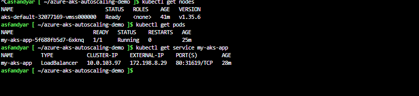
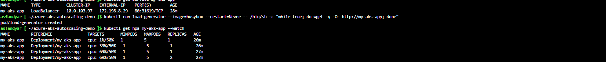
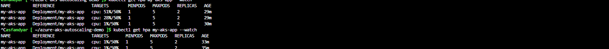
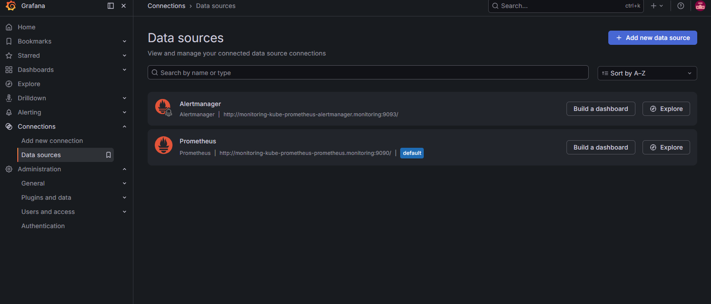
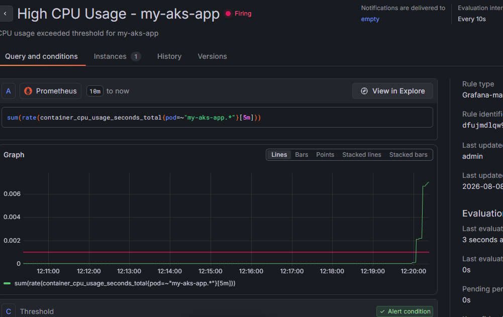

# Azure AKS Autoscaling Demo

A production-style Kubernetes deployment on Azure — provisioned via Terraform, running a containerized app pulled from a private registry, with Horizontal Pod Autoscaling proven under real, generated load.

## Problem

Fixed-capacity infrastructure either wastes money (over-provisioned for average load) or fails under spikes (under-provisioned for peak load). This project demonstrates Kubernetes' core value proposition: infrastructure that automatically scales to match real demand, without manual intervention.

## Architecture

- AKS cluster provisioned entirely via Terraform, not the Azure portal
- Cluster identity directly attached to Azure Container Registry (no manually managed pull secrets)
- App deployed as a Kubernetes Deployment, exposed via a LoadBalancer Service with a real public IP
- Horizontal Pod Autoscaler configured to scale between 1 and 5 pods based on CPU usage

## What Was Tested and Proven

1. Deployed the app from a private Azure Container Registry, authenticated via the cluster's own managed identity
2. Exposed the app through a LoadBalancer Service and confirmed it was reachable via a real public IP
3. Generated sustained load against the app using a temporary in-cluster pod
4. Observed the Horizontal Pod Autoscaler automatically scale from 1 to 2 pods once CPU usage crossed the 50 percent target

5. Removed the load and observed the autoscaler scale back down to 1 pod once usage stayed low past the stabilization window

## How to Deploy

git clone https://github.com/asfandk98/azure-aks-autoscaling-demo.git
cd azure-aks-autoscaling-demo
terraform init
terraform plan
terraform apply

az aks get-credentials --resource-group rg-aks-demo --name aks-demo-cluster
az aks update --resource-group rg-aks-demo --name aks-demo-cluster --attach-acr YOUR_ACR_NAME

kubectl create deployment my-aks-app --image=YOUR_ACR_NAME.azurecr.io/my-first-app:v1
kubectl set resources deployment my-aks-app --requests=cpu=100m
kubectl autoscale deployment my-aks-app --cpu-percent=50 --min=1 --max=5
kubectl expose deployment my-aks-app --type=LoadBalancer --port=80

## What I Would Add at Production Scale

- Helm chart instead of raw kubectl commands, for repeatable, versioned deployments
- Cluster Autoscaler in addition to Horizontal Pod Autoscaler, so the underlying node count also scales, not just pod count
- Azure Monitor and Container Insights for real observability, not just kubectl-based checks
- Ingress controller with proper DNS instead of a raw LoadBalancer IP
- Remote Terraform state, consistent with the pattern used in the secure 2-tier infrastructure project

## Cost Note

AKS control plane is free; only the underlying node VM incurs cost. This cluster is provisioned and destroyed on demand for learning purposes, not left running continuously.

## Observability (Week 8 Addition)

Deployed the kube-prometheus-stack via Helm, adding full monitoring and alerting to the cluster:

- Prometheus collecting real-time cluster and pod-level metrics
- Grafana dashboards showing live CPU, memory, and per-namespace resource usage
- A custom alert rule configured to fire when the app's CPU usage exceeds a defined threshold

## What Was Tested and Proven (Observability)

1. Installed Prometheus, Grafana, and Alertmanager together via a single Helm chart
2. Confirmed pre-built Kubernetes dashboards showing real, live cluster data
3. Created a custom alert rule monitoring the app's actual CPU usage
4. Generated real load against the app and watched the alert transition from Normal to Firing in real time
5. Confirmed the alert's threshold-crossing behavior was accurately reflected on a live graph

## Known Limitation (Honest Callout)

Grafana was exposed via a public LoadBalancer IP for demo convenience during this exercise. This is not the production-correct approach — a real environment would either restrict the LoadBalancer to specific trusted IPs (`loadBalancerSourceRanges`), or more correctly, keep monitoring tools entirely off the public internet, accessible only via VPN, a bastion host, or `kubectl port-forward` from an authenticated session.
